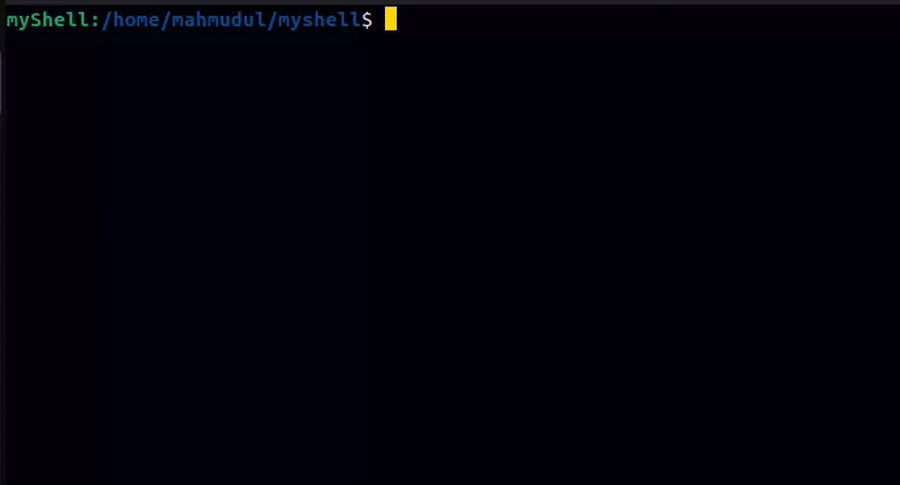

# myshell

A minimal yet feature-rich Unix-like shell implementation in C that demonstrates core operating system concepts such as process management, signal handling, terminal control, and command parsing. This project is designed with a clean, modular architecture and evolves incrementally to showcase real-world shell behaviors similar to bash.

## Architecture

The shell is structured around clear, single-responsibility modules that cooperate through well-defined interfaces:

* **built_in.c**
  Handles built-in commands such as `cd`, `pwd`, `exit`, `help`, and `history` without forking. Built-ins execute in the parent shell context to correctly affect shell state (e.g., working directory, history).

* **pid.c / pid_function.c**
  Manages external command execution using `fork()` and `execvp()`. Returns accurate exit status to the caller, enabling correct logical operator semantics. Error handling distinguishes between fork failures and command-not-found cases.

* **execute_command.c**
  Central command dispatcher. Determines whether a command is built-in or external, routes execution accordingly, and propagates exit codes back to the main loop.

* **read_input.c**
  Implements interactive terminal input using raw mode. Supports backspace, Ctrl+C, Ctrl+D, arrow-key history navigation, and tab-based auto-completion. Ensures terminal state is safely restored after input.

* **auto_complete.c**
  Provides bash-like tab completion for commands and paths. Supports PATH-based command lookup, absolute and relative paths, nested directories, hidden files, single-match completion, and formatted multi-match listings.

* **main.c**
  The event loop of the shell. Renders the colored prompt, reads user input, parses logical operators (`&&`, `||`), manages interactive state, installs signal handlers, and controls command chaining behavior.

## Features

* Built-in commands executed without forking
* External command execution via `fork()` / `execvp()`
* Logical operators: `&&` and `||`
* Persistent command history saved in `$HOME/.history`
* Arrow-key navigation through command history
* Tab-based auto-completion for commands and file paths
* Nested directory and path completion
* Background process execution using `&`
* SIGCHLD handling for zombie process cleanup
* Robust Ctrl+C handling without terminating the shell
* Ctrl+D support to exit on empty input
* Portable runtime path handling using `pathconf()` (no fixed `PATH_MAX`)

## Built-in Commands

* `cd [path]` – Change the current working directory (no argument defaults to `$HOME`)
* `pwd` – Print the current working directory
* `history` – Display command history with persistent numbering
* `help` – Show built-in command reference
* `exit` – Terminate the shell

## Operator Support

* `&&` Logical AND – Execute the right-hand command only if the left-hand command succeeds
  Example:

  ```sh
  cd /tmp && ls
  ```

* `||` Logical OR – Execute the right-hand command only if the left-hand command fails

## Building

```sh
make
```

Compiles all source modules with the include path set to the `include/` directory.

## Running

```sh
./myshell
```

The shell displays a colored prompt with the current working directory and continues accepting commands until `exit` is invoked or Ctrl+D is pressed on an empty line.

## External Commands

External programs are executed in child processes created via `fork()`. The parent process waits (or does not wait, for background jobs) and propagates exit codes upward. This design enables correct logical operator behavior and clean process lifecycle management.

## Demo

A demo GIF showcasing interactive usage (history, auto-complete, operators) is included in the repository.


## Notes

This project prioritizes clarity, correctness, and educational value over raw performance. It serves as a practical reference for understanding how real shells manage input, processes, signals, and execution flow, and is not intended for production use.
